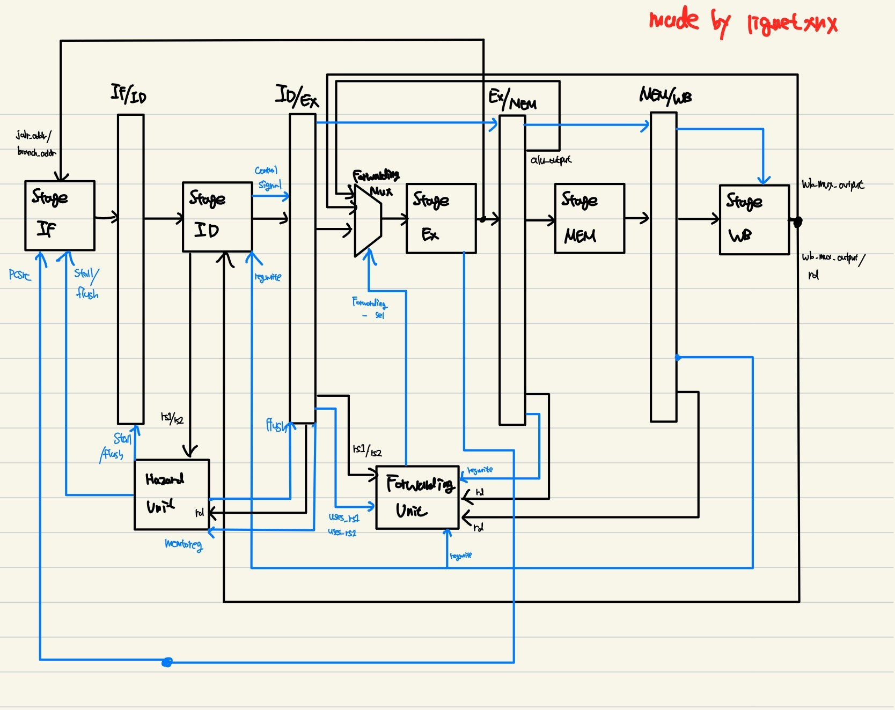

# Notice

This project is on going. Control Hazard, Data Hazard are verified

Now I am implementing FPGA verification.

# RV32I-5-stage-pipeliend processor and C-Code Simulation Verification

## Table of Contents
- [0. TL/DR](#0-tldr)
- [1. Project Overview](#1-project-overview)
- [2. Architecture](#2-architecture)
- [3. Hazard Logic](#3-hazard-logic)
- [4. Supported Instructions](#4-supported-instructions)
- [5. Verification](#5-verification)
- [6. How to Run?](#6-how-to-run)
- [7. Limitation and Next Goal](#7-limitation-and-next-goal)
- [8. License](#8-license)

# 0. TL/DR

- **Core** : RV32I 5-stage-pipelined processor (Verilog)
- **Support** : R, I, S, B, J, U type (only word load and store are supported in loading and store instrution)
- **Memory architecture** : Harvard Architecture(seperate Instruction memory, and Data memory) 
- **Addressing** : PC and IM(8KB) is byte-addressed otherwise, Memory(16KB) are word-addressed.
- **Endians** : Little - endians (RISC-V default)
- **Verification** : self-checking C-code excuted by tb_cpu.v
- **Run** : make, (and "gtkwave waves_cpu.vcd")
- **Limitation and Next goal** : Explain below.

- **More detail** : Blog will upload soon

## Environment :
- 	Linux
-	Icarus Verilog
-	GTKWave for wave form viewing

## Run (manual)
-	make
-	gtkwave waves_cpu.vcd

## Expected output(file)
- Verifiaction_result (pass/fail file)
- trace.log (log data when reg_write, mem_write happen)
- waves_cpu.vcd (simulation data)

# 1. Project Overview

**Goals**
-	Make 5-stage-pipelined core implemented hazard solution
-   Specific c-code excution on bare-metal enviornment
-	Clean and readable datapath/control
-	Deterministric simulation
-	Verification-first work flow
-   FPGA verification (be going another project)

**None Goals**
-	No CSR/privilege/interrupt
-	No MUL and DIV for (RV32M)
-	Misaligned access handling

# 2. Architecture

- Harvard Architecture

- Block Diagaram

- Top module

    - stage_IF
        - PC
        - PC_MUX
        - IM
        - ADDER (for pc+4)

    - reg_IF_ID

    - stage_ID
        - Reg_File
        - Control_Unit
        - ImmGen

    - reg_ID_EX

    - Hazard_Unit

    - stage_EX
        - ALU_A_MUX
        - ALU_B_MUX
        - Forwarding_A_MUX
        - Forwarding_B_MUX
        - ALU_Control
        - ALU
        - Branch_Unit
        - Branch_ADDER

    - Forwarding_Unit

    - reg_EX_MEM

    - stage_MEM
        -DMEM

    - reg_MEM_WB

    - stage_WB
        - WB_MUX

# 3. Hazard Logic
//Describe what I have implmented 
// update soon

1. Data Hazard (RAW)
    - ALU-ALU dependency
        : By Forwarding to EX stage
    - ALU - Store Dependency
        : By Forwarding to ID stage
    - Load - ALU Dependency
        : By Stall

# 4. Supported Instructions

> Note: Only **word** load/store are implemented: `lw`, `sw`  
> Byte/halfword memory ops are **not** supported: `lb/lh/lbu/lhu/sb/sh`

| Type | Instructions | Status | Notes |
|---|---|---:|---|
| R | `add`, `sub`, `sll`, `slt`, `sltu`, `xor`, `srl`, `sra`, `or`, `and` | ✅ | Full RV32I R-type ALU ops |
| I (ALU) | `addi`, `slti`, `sltiu`, `xori`, `ori`, `andi`, `slli`, `srli`, `srai` | ✅ | Shift-immediate included |
| I (Load) | `lw` | ✅ | **Word only** |
| S (Store) | `sw` | ✅ | **Word only** |
| B | `beq`, `bne`, `blt`, `bge`, `bltu`, `bgeu` | ✅ | Branch compare + PC redirect |
| U | `lui`, `auipc` | ✅| Large constant / PC-relative / Big-constant|
| J | `jal` | ✅ | Link register writeback |
| I (Jump) | `jalr` | ✅ | Target = `(rs1 + imm) & ~1` |
| RV32M | `mul/div/rem*` | ❌ | Not implemented |
| Exception | `CSR/*` | ❌ | Not implemented |

# 5. Verification 

## What this verifies

- Operate cpu by simple c code(*prog.c*) to verification.

- ***All command is verified just one time on tb_cpu.vcd***

### Why I used signature (sig[]) array for verification?

To verify the CPU behavior without relying on waveform inspection, I used a memory-mapped signature array (sig[]) as a verification output buffer.
The program writes the results of key operations (ALU instructions, branches, loads/stores, jumps, etc.) into sig[], which is fixed at address 0x200 in data memory.
The stack pointer is initialized to 0x4000, so the stack grows downward while keeping the signature region safe from being overwritten.
With this setup, the testbench can simply monitor this small memory region and perform a direct comparison:

Deterministic and scalable testing: Instead of manually tracing internal signals, I can validate many instructions by checking a compact, fixed memory window.

Fast debugging: If a mismatch occurs, the failing signature index immediately shows which step or instruction sequence is incorrect, avoiding long waveform debugging sessions.

Overall, the signature array turns CPU verification into a simple PASS/FAIL memory comparison, making regression testing much more efficient and reproducible.

## Simulation outputs

- **Verification_results**
    - 
    - **Target files** indicated verification is corrected. It store simple PASS/FAIL memory comparison.
    

- trace.log
    - 
    - prints register writeback events: pc(hex), reg_indx(deci), wdata(deci)
    - prints store events: pc(hex), mem_addr(hex), wdata(deci)
    - (cycle count is not printed)

- waves_cpu.vcd
    - 
    - waveform dump for debugging in GTKWave

# 6. How to Run?
>First of all, you have to install gtkwave, iverilog, gcc compiler. 

>OS is Ubuntu.

## Command
- `make`
    - make all verification files. such as **Verification_results**, trace.log, waves_cpu.vcd.
- `make dump`
    - make rv32i assembly files on `prog.c` code.
- `make clean`
    - clean all files from 'make' command
- `gtkwave waves_cpu_vcd`
    - After `make` command, open simulation wave form.

# 7. Limitation and Next Goal

- **Can't be runned on modern computer**
    - not implemented any `CSRS` command
    - Limited memory (16KB)

- **Next Goal**
    - FPGA verification

# 8. License
This project is licensed under the MIT License - see the [LICENSE](./LICENSE) file for details.

Copyright (c) 2026 Eunsang(liquetxnx)
